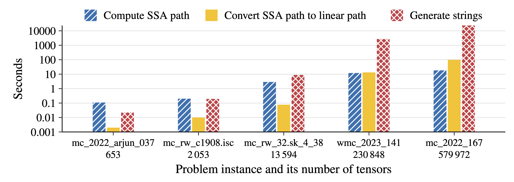
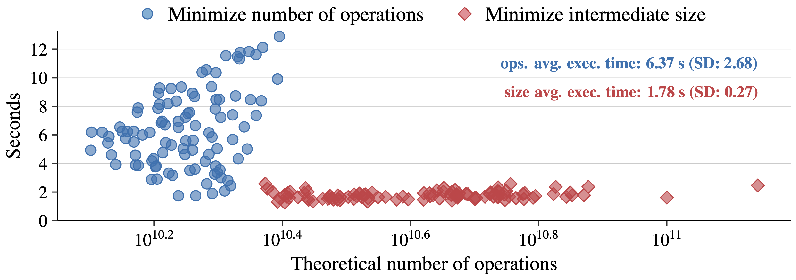

import { LinkCard } from '@astrojs/starlight/components';

Our experiments highlight the necessity for a comprehensive einsum benchmark, revealing:

- Metadata generation and path conversion have significant overhead for large instances while computing contraction paths.
- A low number of floating point operations does not guarantee short execution times for einsum expressions.
- Efficient support for sparse tensors is lacking.
- Integer datatypes are poorly supported and perform rather inefficiently on current einsum backends.

<LinkCard title="Code for experiments" href="https://github.com/ti2-group/einsum_benchmark_experiments" />

## Performance on Large Instances

Before executing an einsum expression, a contraction path must first be computed.
The question we address here is whether this path computation is scalable to large problem sizes.
We compute a single contraction path using `opt_einsum` and its greedy algorithm and perform the path computations for five einsum expressions.

As einsum expressions increase in scale, surprising inefficiencies in `opt_einsum` become apparent. After a contraction path is computed, generating the strings that describe the pairwise computations emerges as a severe bottleneck as the expressions grow larger. Additionally, the conversion from the internally used SSA path format to the less efficient linear path format, which serves as the output format, starts to overshadow the time actually spent on computing a valid path.

## Execution Time and Number of Operations

When executing an einsum expression along a specified contraction path, current libraries map the individual pairwise tensor contractions to highly efficient linear algebra or tensor library calls. However, such tensor contractions only achieve peak performance when both involved tensors are large and their shapes are not skewed.
For example, performing a matrix-matrix multiplication $AB$, where matrix $A$ is in $R^{2 \times 2}$ and matrix $B$ in $R^{2 \times 2^{30}}$, is highly inefficient with current libraries. However, these types of contractions are abundant, particularly in quantum computing problems.

Ironically, optimizing the contraction path to minimize the number of operations often leads to skewed tensor contractions during the execution of the expression.
To demonstrate that the number of theoretical operations serves only as a relatively weak estimator of the execution time for an einsum expression, we compute 200 contraction paths using `cotengra` for a quantum computing problem. Among these contraction paths, 100 paths are optimized to minimize the number of operations, whereas the remaining 100 paths aim to minimize the intermediate tensor size. The following figure shows the execution times across all computed paths using `opt_einsum` with a PyTorch backend.

Minimizing the intermediate tensor size when computing contraction paths can lead to more balanced tensor contractions and, consequently, lower average execution times compared to paths optimized solely to minimize the theoretical number of operations. Therefore, focusing solely on reducing the number of operations, without accounting for the skewness of resulting pairwise contractions, can compromise performance.

Also, neglecting to optimize linear algebra and tensor libraries for skewed contractions is a significant oversight, given their frequent occurrence. Both aspects accounting for skewness in computing contraction paths and enhancing the speed of skewed tensor contractions must be addressed to improve execution times of einsum expressions.

## Sparse Tensors

Input tensors containing one or more zeros can result in highly sparse intermediate tensors. Initially, these problems may appear dense, but they can become sparse while evaluating the expression.
In the benchmark, this phenomenon is particularly evident for model counting and weighted model counting problems, as well as for certain quantum computing problems.
We show that mapping tensors to SQLite tables and running a SQL query to retrieve the result outperforms PyTorch, which clearly signals that incorporating sparse-aware algorithms into einsum libraries could significantly enhance their efficiency.

[^1]: [Efficient and Portable Einstein Summation in SQL](https://dl.acm.org/doi/abs/10.1145/3589266)

## Data Type Support

The tensors used in the einsum expressions of the benchmark are of various data types, including `int16`, `int32`, `int64`, `float32`, `float64`, `complex64`, and `complex128`. To investigate whether this expectation holds true in practice, we select one `int16` einsum problem (`mc_rw_blockmap_05_01.net`) and convert it to all data types that are sufficiently large to retain the exact solution. The following table shows the execution times for this expression across the various data types and `opt_einsum` backends.

| Backend        | int16                   | int32                  | int64                  | float32                | float64                | complex64              | complex128             |
| -------------- | ----------------------- | ---------------------- | ---------------------- | ---------------------- | ---------------------- | ---------------------- | ---------------------- |
| NumPy[^a]      | N/A                     | N/A                    | N/A                    | N/A                    | N/A                    | N/A                    | N/A                    |
| PyTorch[^b]    | N/A                     | N/A                    | 41.77&nbsp;±&nbsp;0.38 | 5.18&nbsp;±&nbsp;0.18  | 7.93&nbsp;±&nbsp;0.29  | 8.16&nbsp;±&nbsp;0.29  | 13.78&nbsp;±&nbsp;0.24 |
| TensorFlow[^c] | N/A                     | 41.58&nbsp;±&nbsp;0.17 | 44.45&nbsp;±&nbsp;0.13 | N/A                    | 42.30&nbsp;±&nbsp;0.11 | 43.59&nbsp;±&nbsp;0.15 | 47.89&nbsp;±&nbsp;0.09 |
| JAX[^d]        | 220.18&nbsp;±&nbsp;0.91 | 25.27&nbsp;±&nbsp;0.13 | N/A                    | 19.36&nbsp;±&nbsp;0.08 | N/A                    | 31.91&nbsp;±&nbsp;0.07 | N/A                    |

[^a]: Error: _too many subscripts in einsum_, caused in NumPy by exceeding the maximum of 32 different indices. See also [here](https://github.com/dgasmith/opt_einsum/issues/80)
[^b]: Scalar type errors due to hidden conversions from `int16` and `int32` to `int64` during pairwise contractions.
[^c]: No `int16` support. For `float32`, it only supports tensors with a rank ≤ 12, but this problem requires rank 28.
[^d]: Truncates `int64` to `int32`, `float64` to `float32`, and `complex128` to `complex64`.

